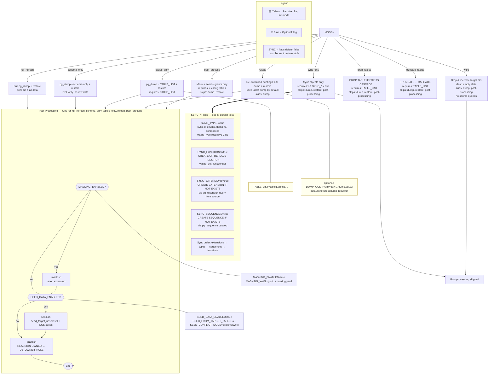

# GCP Sandbox Database Loader

A production-grade Cloud Run Job that synchronizes a production Cloud SQL PostgreSQL database into a sandbox environment across different GCP projects. Supports full/schema/table-level sync, data masking, synthetic data injection, and safe destructive operations.

## Mode & Flag Reference



### Flag × Mode Matrix

| Flag | `full_refresh` | `schema_only` | `tables_only` | `sync_only` | `wipe` | `reload` | `drop_tables` | `truncate_tables` | `post_process` |
|---|---|---|---|---|---|---|---|---|---|---|---|
| **`TABLE_LIST`** | ✗ | ✗ | **required** | ✗ | ✗ | ✗ | **required** | **required** | ✗ |
| **`DUMP_GCS_PATH`** | auto | auto | auto | ✗ | ✗ | auto\* | ✗ | ✗ | ✗ |
| **`FK_DEPTH`** | ✓ | ✓ | ✓ | ✗ | ✗ | ✓ | ✗ | ✗ | ✗ |
| **`SYNC_TYPES`** | ✗ | ✗ | ✓ | ✓ | ✗ | ✗ | ✗ | ✗ | ✗ |
| **`SYNC_FUNCTIONS`** | ✗ | ✗ | ✓ | ✓ | ✗ | ✗ | ✗ | ✗ | ✗ |
| **`SYNC_SEQUENCES`** | ✗ | ✗ | ✓ | ✓ | ✗ | ✗ | ✗ | ✗ | ✗ |
| **`SYNC_EXTENSIONS`** | ✓ | ✓ | ✓ | ✓ | ✗ | ✓ | ✗ | ✗ | ✗ |
| **`MASKING_ENABLED`** | ✓ | ✓ | ✓ | ✗ | ✗ | ✓ | ✗ | ✗ | ✓ |
| **`SEED_DATA_ENABLED`** | ✓ | ✓ | ✓ | ✗ | ✗ | ✓ | ✗ | ✗ | ✓ |
| **`SEED_FROM_TARGET_TABLES`** | ✗ | ✗ | ✓ | ✗ | ✗ | ✓ | ✗ | ✗ | ✗ |
| **`SEED_CONFLICT_MODE`** | ✗ | ✗ | ✓ | ✗ | ✗ | ✓ | ✗ | ✗ | ✗ |

> \* For `reload`: defaults to the latest dump in `gs://<GCS_BUCKET>/dumps/`. Set `DUMP_GCS_PATH` explicitly to pin a specific dump.
> `SYNC_EXTENSIONS` is part of the native restore path for `full_refresh`/`schema_only`/`reload` via `setup_extensions()`.
> ✗ = ignored, ✓ = available, **required** = must be set.

## Recommended Workflow

The source proxy is only started for modes that query the production database (`full_refresh`, `schema_only`, `tables_only`, `sync_only`). Modes that operate solely on the target (`reload`, `wipe`, `drop_tables`, `truncate_tables`, `post_process`) skip the source proxy entirely, reducing Cloud Run resource usage and avoiding unnecessary connections to the source instance.

### Bootstrap → Tables Pipeline

Custom types, sequences, functions, and extensions are supporting objects that `tables_only` mode does not automatically extract from FK-referenced tables. A single `sync_only` run seeds them into the target so subsequent `tables_only` runs have everything they need.

**Step 1 — Bootstrap supporting objects (one-time or as-needed):**
```bash
# .env
MODE=sync_only
SYNC_TYPES=true
SYNC_SEQUENCES=true
SYNC_FUNCTIONS=true
SYNC_EXTENSIONS=true
```
This syncs all custom types (enums, domains, composites), sequences, functions (excluding `LANGUAGE c`), and extensions from the source to the target.

**Step 2 — Restore tables (repeatable):**
```bash
# .env
MODE=tables_only
TABLE_LIST=client_codes,users,...
FK_DEPTH=-1
```
With supporting objects already present, `FK_DEPTH=-1` resolves the full transitive FK chain and all tables restore with their foreign key constraints intact.

A re-bootstrap is only needed when new types, sequences, or functions are added to the source schema. The `SYNC_*` flags are safe no-ops on re-run — `CREATE IF NOT EXISTS` / `CREATE OR REPLACE` patterns handle idempotency.

### Schema + Seed → Tables Pipeline

This flow creates a complete sandbox database without running a full production dump. Useful when you want synthetic data for most tables but real production data for specific tables.

**Step 1 — Create schema and inject synthetic data (one-time):**
```bash
# .env
MODE=schema_only
SEED_DATA_ENABLED=true
```
This restores the full DDL (all tables, indexes, constraints) empty, then applies seed SQL to populate them with synthetic data.

**Step 2 — Overwrite specific tables with real data (repeatable):**
```bash
# .env
MODE=tables_only
TABLE_LIST=notification_provider,notification_status
FK_DEPTH=-1
SEED_DATA_ENABLED=false   # avoid re-seeding tables already populated
```
Tables in `TABLE_LIST` (and their FK chain) are dropped and restored from production. All other tables keep their synthetic data from Step 1.

**Step 3 — Sync grants (one-time after Step 2):**
```bash
# .env
MODE=post_process
MASKING_ENABLED=false
SEED_DATA_ENABLED=false
```
Re-runs the grant phase to transfer ownership of the newly restored tables from the IAM user to `DB_OWNER_ROLE`. Skip this if running `tables_only` with grants already configured (grants run automatically with `tables_only`).

> **Note:** Unlike the Bootstrap → Tables pipeline, this flow creates the entire schema upfront via `schema_only` rather than relying on `tables_only` to create tables from the dump. Use the Bootstrap → Tables pipeline when you need real data for every table; use this pipeline when you want a hybrid — synthetic data for most tables and targeted real data for a subset.

## Features

| Feature | Description |
|---|---|
| **Full refresh** | Dump and restore entire database (schema + data) |
| **Schema only** | Restore DDL structure without row data |
| **Table-level** | Restore specific tables only |
| **Data masking** | Apply anonymization via PostgreSQL `anon` extension |
| **Synthetic data** | Inject seed SQL files from GCS |
| **Target-preserving seed data** | Backup target tables before restore, upsert back after — keep sandbox-specific rows alongside prod data |
| **Safe destructive ops** | Terminate connections, backup-safe DROP/CREATE |
| **IAM authentication** | No passwords — Cloud SQL Proxy + ADC |
| **Local Docker PostgreSQL** | Full pipeline works against local PG via Docker Compose (USE_PROXY=false) |
| **Structured logging** | Timestamped phase markers with duration metrics |

## Architecture

```
Cloud Run Job
├── entrypoint.sh          # Orchestrator (validate → proxy → [seed_backup] → dump → restore → [mask] → [seed] → grant)
│
├── scripts/
│   ├── dump.sh            # pg_dump → GCS upload
│   ├── restore.sh         # GCS download → pg_restore with connection termination
│   ├── seed_target_backup.sh  # pg_dump target tables → upsert seed file (before restore)
│   ├── seed.sh            # Apply seed files (target backup + GCS seeds)
│   ├── mask.sh            # anon extension + masking.yaml + mask.sql
│   ├── grant.sh           # Post-restore permission setup
│   └── lib/log.sh         # Shared structured logging
│
├── docker-compose.yml     # Local PostgreSQL (source + target) for testing
├── Dockerfile             # google/cloud-sdk:alpine + pg15-client + Cloud SQL Proxy v2
└── test/
    ├── seed-source.sql    # Test schema (circular FKs, enums, deep chains)
    └── seed-data.sql      # Minimal seed data (businesses, filings, offices)
```

```
Cloud Storage (gs://<GCS_BUCKET>/)
├── dumps/                 # Database dumps (timestamped)
│   └── dump_YYYYMMDD_HHMMSS.sql
└── scripts/               # Operator-managed scripts
    ├── mask.sql            # Custom masking SQL (optional)
    ├── grant.sql           # Post-restore grants (optional)
    ├── masking.yaml        # Masking rules (optional)
    └── seeds/             # Synthetic data files (applied in sort order)
        ├── 01_users.sql
        └── 02_orders.sql
```

## Prerequisites

### GCP Setup

1. **Cloud SQL instances** — PostgreSQL 15+ in both source (prod) and target (sandbox) projects
2. **GCS bucket** for dump staging and scripts
3. **Service account** for Cloud Run Job with these IAM roles:
   - `roles/cloudsql.client` on both projects (for Cloud SQL Proxy)
   - `roles/storage.objectAdmin` on the GCS bucket
4. **IAM database users** created in both Cloud SQL instances:
   ```sql
   -- Run as Cloud SQL admin on source instance
   -- User name format: service-account@project-id.iam
   -- (Cloud SQL IAM users are created via the GCP Console or gcloud, not via SQL)
   ```
   ```bash
   # Create IAM database user in Cloud SQL
   gcloud sql users create "sa-db-reader@prod-project.iam" \
     --instance=prod-instance \
     --type=CLOUD_IAM_SERVICE_ACCOUNT \
     --project=prod-project
   
   gcloud sql users create "sa-db-admin@sandbox-project.iam" \
     --instance=sandbox-instance \
     --type=CLOUD_IAM_SERVICE_ACCOUNT \
     --project=sandbox-project
   ```

5. **Cloud SQL flags** (optional but recommended):
   ```bash
   gcloud sql instances patch prod-instance \
     --database-flags=cloudsql.iam_authentication=on
   ```

### Local Development Prerequisites

- `gcloud` CLI installed and authenticated (for Cloud SQL mode only)
- `docker` + `docker compose` installed (for local PostgreSQL testing)
- Cloud SQL Proxy v2: [Download](https://cloud.google.com/sql/docs/postgres/sql-proxy) (for Cloud SQL mode only)
- `pg_dump`, `psql` (PostgreSQL 15 client tools)

## Local Development Setup

### 1. Authenticate with GCP

```bash
# One-time setup — authenticates all GCP tools (gcloud, Cloud SQL Proxy)
gcloud auth application-default login

# Verify authentication
gcloud auth application-default print-access-token
```

### 2. Configure environment

```bash
cp .env.example .env
# Edit .env with your project IDs, instance names, and database names
```

### 3. Run locally (without Docker)

Start Cloud SQL Proxies manually in separate terminals:

```bash
# Terminal 1: Source proxy (port 5432)
cloud-sql-proxy prod-project:northamerica-northeast1:prod-instance \
  --port 5432 --auto-iam-authn

# Terminal 2: Target proxy (port 5433)
cloud-sql-proxy sandbox-project:northamerica-northeast1:sandbox-instance \
  --port 5433 --auto-iam-authn
```

Then run the entrypoint:

```bash
chmod +x scripts/*.sh scripts/lib/*.sh
set -a; source .env; set +a; ./scripts/entrypoint.sh
```

Or run individual phases:

```bash
set -a; source .env; set +a

# Dump only
./scripts/dump.sh

# Restore a specific dump
export DUMP_GCS_PATH=gs://my-bucket/dumps/dump_20260618_102345.sql
./scripts/restore.sh

# Mask after restore
export MASKING_ENABLED=true
./scripts/mask.sh

# Inject seed data
export SEED_DATA_ENABLED=true
./scripts/seed.sh

# Apply grants
./scripts/grant.sh
```

### 4. Build and test with Docker

```bash
docker build -t sandbox-loader:local .

docker run --rm \
  -e MODE=schema_only \
  -e SOURCE_PROJECT=prod-project \
  -e SOURCE_REGION=northamerica-northeast1 \
  -e SOURCE_INSTANCE=prod-instance \
  -e SOURCE_DB=prod_db \
  -e SOURCE_DB_USER=sa-db-reader@prod-project.iam \
  -e TARGET_PROJECT=sandbox-project \
  -e TARGET_REGION=northamerica-northeast1 \
  -e TARGET_INSTANCE=sandbox-instance \
  -e TARGET_DB=sandbox_db \
  -e TARGET_DB_USER=sa-db-writer@sandbox-project.iam \
  -e GCS_BUCKET=my-project-db-dumps \
  sandbox-loader:local
```

### 5. Local PostgreSQL (Docker Compose)

Spin up local PostgreSQL containers to test the full pipeline without GCP credentials or Cloud SQL Proxy. Source DB on `:5432`, target DB on `:5434`.

```bash
# Start containers (schema + seed data auto-loaded into source-db)
docker compose up -d

# Wait for healthchecks to pass
docker compose ps

# Load env vars and run
set -a; source .env.test; set +a
./scripts/entrypoint.sh

# Tear down (destroys all data)
docker compose down -v
```

**What `.env.test` does:**
- `MODE=tables_only` + `TABLE_LIST=businesses` + `FK_DEPTH=-1` — dumps businesses and resolves the full transitive FK chain
- `USE_PROXY=false` — skips Cloud SQL Proxy startup
- `SEED_DATA_ENABLED=true` + `SEED_FROM_TARGET_TABLES=office_types` — backs up `office_types` from target, restores from dump, then upserts the backed-up rows
- `SEED_CONFLICT_MODE=overwrite` — seed rows win on conflict

**Test schema (`test/seed-source.sql`):**
- Circular FKs: `businesses` ↔ `filings` (`state_filing_id` ↔ `business_id`)
- Self-referencing FK: `filings.parent_filing_id → filings.id`
- Deep FK chain: `businesses → offices → party_roles`
- Custom enums: `business_state`, `filing_status`, `office_type_code`
- Tables with no PK (`addresses`) — tests seed_target_backup fallback

**Key difference from Cloud SQL mode:**
- `PGPASSWORD` uses `DB_PASSWORD` (real password) instead of the IAM sentinel `"iam"`
- `GCS_BUCKET` is optional — dump.sh skips GCS upload when unset
- `SOURCE_DB_USER` / `TARGET_DB_USER` are plain roles, not IAM service accounts

## Cloud Run Job Deployment

### Build and push image

```bash
export PROJECT_ID=sandbox-project
export REGION=northamerica-northeast1
export IMAGE_URI="${REGION}-docker.pkg.dev/${PROJECT_ID}/sandbox-loader/db-loader:latest"

gcloud builds submit --tag "${IMAGE_URI}"
```

### Create Cloud Run Job

```bash
gcloud run jobs create sandbox-db-loader \
  --image="${IMAGE_URI}" \
  --region="${REGION}" \
  --service-account="sa-db-admin@${PROJECT_ID}.iam.gserviceaccount.com" \
  --set-env-vars="MODE=full_refresh" \
  --set-env-vars="SOURCE_PROJECT=prod-project" \
  --set-env-vars="SOURCE_REGION=northamerica-northeast1" \
  --set-env-vars="SOURCE_INSTANCE=prod-instance" \
  --set-env-vars="SOURCE_DB=prod_db" \
  --set-env-vars="SOURCE_DB_USER=sa-db-reader@prod-project.iam" \
  --set-env-vars="TARGET_PROJECT=${PROJECT_ID}" \
  --set-env-vars="TARGET_REGION=northamerica-northeast1" \
  --set-env-vars="TARGET_INSTANCE=sandbox-instance" \
  --set-env-vars="TARGET_DB=sandbox_db" \
  --set-env-vars="TARGET_DB_USER=sa-db-writer@${PROJECT_ID}.iam" \
  --set-env-vars="GCS_BUCKET=my-project-db-dumps" \
  --memory=2Gi \
  --cpu=2 \
  --task-timeout=3600
```

### Execute the job

```bash
gcloud run jobs execute sandbox-db-loader --region="${REGION}"
```

### Schedule with Cloud Scheduler

```bash
# Run every weekday at 2 AM Pacific
gcloud scheduler jobs create http sandbox-db-loader-schedule \
  --location="${REGION}" \
  --schedule="0 2 * * 1-5" \
  --time-zone="America/Vancouver" \
  --uri="https://${REGION}-run.googleapis.com/apis/run.googleapis.com/v1/namespaces/${PROJECT_ID}/jobs/sandbox-db-loader:run" \
  --http-method=POST \
  --oauth-service-account-email="sa-scheduler@${PROJECT_ID}.iam.gserviceaccount.com"
```

## Environment Variables Reference

### Required

| Variable | Description |
|---|---|---|
| `MODE` | `full_refresh` \| `schema_only` \| `tables_only` \| `sync_only` \| `wipe` \| `reload` \| `drop_tables` \| `truncate_tables` \| `post_process` |
| `SOURCE_PROJECT` | GCP project ID of production database |
| `SOURCE_REGION` | Cloud SQL region (e.g. `northamerica-northeast1`) |
| `SOURCE_INSTANCE` | Cloud SQL instance name |
| `SOURCE_DB` | Source database name |
| `SOURCE_DB_USER` | IAM database user (format: `sa@project.iam`) |
| `TARGET_PROJECT` | GCP project ID of sandbox database |
| `TARGET_REGION` | Cloud SQL region |
| `TARGET_INSTANCE` | Cloud SQL instance name |
| `TARGET_DB` | Target database name |
| `TARGET_DB_USER` | IAM database user for target (handles DDL and DML) |
| `GCS_BUCKET` | GCS bucket name (without `gs://`). Optional when `USE_PROXY=false` (local mode). |

### Optional

| Variable | Default | Description |
|---|---|---|---|
| `TABLE_LIST` | `""` | Comma-separated tables (required for `tables_only` mode) |
| `FK_DEPTH` | `-1` | FK dependency depth for `tables_only`: `0` = strip all FK constraints (only TABLE_LIST dumped), `-1` = resolve full transitive FK chain (recommended). FK-referenced tables are dropped before restore alongside TABLE_LIST. Requires supporting objects (types, functions, sequences) to be present — run `sync_only` once first to bootstrap (see Recommended Workflow). |
| `SOURCE_SCHEMA` | `public` | Schema to dump from source |
| `TARGET_SCHEMA` | `public` | Schema to restore into target |
| `MASKING_ENABLED` | `false` | Apply data masking after restore |
| `MASKING_YAML` | `/scripts/masking.yaml` | Path or GCS URI to masking rules |
| `SEED_DATA_ENABLED` | `false` | Inject synthetic seed data after restore |
| `SEED_FROM_TARGET_TABLES` | `""` | Comma-separated tables to backup from target before restore and upsert as seed data. Only for `tables_only` and `reload` modes. Requires `SEED_DATA_ENABLED=true`. |
| `SEED_CONFLICT_MODE` | `skip` | What to do on row conflict: `skip` = keep prod row (`ON CONFLICT DO NOTHING`), `overwrite` = seed row wins (`ON CONFLICT DO UPDATE` via PK introspection). |
| `SKIP_EXISTING_DUMP` | `false` | Skip dump if file already exists in GCS |
| `ALLOW_PROD_TARGET` | `false` | Allow target with "prod" in name (safety override) |
| `LOG_LEVEL` | `INFO` | Log verbosity: `DEBUG` \| `INFO` \| `WARN` \| `ERROR` |
| `USE_PROXY` | `true` | Start Cloud SQL Proxy. Set `false` for local Docker PostgreSQL. When false, `GCS_BUCKET` is optional and `DB_PASSWORD` is used for auth. |
| `DB_PASSWORD` | `iam` | Database password. Only used when `USE_PROXY=false`. In Cloud SQL mode, IAM auth is used and this is ignored. |
| `SOURCE_PGHOST` | `127.0.0.1` | Source database host override (Docker or external PG) |
| `SOURCE_PGPORT` | `5432` | Source database port override |
| `TARGET_PGHOST` | `127.0.0.1` | Target database host override (Docker or external PG) |
| `TARGET_PGPORT` | `5434` | Target database port override (default 5434 to avoid collision with source) |

## Data Masking Setup

1. Copy `masking.yaml.example` to `masking.yaml`:
   ```bash
   cp masking.yaml.example masking.yaml
   # Edit rules for your schema
   ```

2. Upload to GCS:
   ```bash
   gcloud storage cp masking.yaml gs://my-project-db-dumps/scripts/masking.yaml
   ```

3. Set environment variables:
   ```bash
   MASKING_ENABLED=true
   MASKING_YAML=gs://my-project-db-dumps/scripts/masking.yaml
   ```

The masking pipeline:
1. Installs `pgcrypto` and `anon` extensions
2. Generates `UPDATE` statements from `masking.yaml` rules
3. Applies additional `mask.sql` from GCS (if present)

## Seed Data Setup

Seed data comes from two sources, both applied after restore:

1. **Target backup** — tables listed in `SEED_FROM_TARGET_TABLES` are `pg_dump`ed from the target *before* the restore, then upserted back after (modes: `tables_only`, `reload`). Backed up rows are applied first; GCS seed files run second and can override.

2. **GCS seed files** — optional `.sql` files in `gs://<bucket>/scripts/seeds/`, applied in sorted order. Use these for synthetic data that doesn't exist in the target.

Backup seed files must be idempotent (safe to run multiple times):

```sql
-- 01_test_users.sql
INSERT INTO users (id, email, first_name, last_name)
VALUES
  ('00000000-0000-0000-0000-000000000001', 'alice@example.com', 'Alice', 'Test'),
  ('00000000-0000-0000-0000-000000000002', 'bob@example.com',   'Bob',   'Test')
ON CONFLICT (id) DO NOTHING;
```

Upload seed files to GCS:
```bash
gcloud storage cp seeds/*.sql gs://my-project-db-dumps/scripts/seeds/
```

## Permissions Setup

Copy and customize `grant.sql.example`:
```bash
cp grant.sql.example grant.sql
# Edit to assign your IAM service accounts to roles
gcloud storage cp grant.sql gs://my-project-db-dumps/scripts/grant.sql
```

## Troubleshooting

### Cloud SQL Proxy fails to start

```
Error: Source Cloud SQL Proxy (PID 123) failed to start.
```

**Check:**
- Service account has `roles/cloudsql.client` on the source project
- Instance connection name is correct (`PROJECT:REGION:INSTANCE`)
- ADC is configured: `gcloud auth application-default print-access-token`

### IAM database authentication fails

```
FATAL: IAM authentication failed for user "sa-db-reader@prod.iam"
```

**Check:**
- IAM database user was created in Cloud SQL:
  ```bash
  gcloud sql users list --instance=prod-instance --project=prod-project
  ```
- Cloud SQL flag `cloudsql.iam_authentication=on` is set
- Proxy was started with `--auto-iam-authn`

### `DROP DATABASE` fails — active connections

```
ERROR: database "sandbox_db" is being accessed by other users
```

`restore.sh` automatically handles this with a polling loop. If it times out, check for long-running transactions or connection poolers connected to the sandbox database.

### Dump is too large / timeout

Increase Cloud Run Job timeout:
```bash
gcloud run jobs update sandbox-db-loader --task-timeout=7200
```

For very large databases, consider using `pg_dump --format=custom` (compressed) instead of plain SQL and `pg_restore` instead of `psql` — update `dump.sh` and `restore.sh` accordingly.

### Masking fails — anon extension not available

The `anon` (postgresql-anonymizer) extension must be installed on your Cloud SQL instance. Check availability:
```bash
gcloud sql instances describe sandbox-instance --format="value(databaseVersion)"
```

If `anon` is not available, use a custom `mask.sql` with plain `UPDATE` statements instead.

## Security Notes

- **No hardcoded credentials** — all authentication via ADC and IAM
- **PGPASSWORD is always empty** for IAM auth (Cloud SQL mode) — set and immediately unset after use
- **DB_PASSWORD** is only used when `USE_PROXY=false` (local Docker mode). In Cloud SQL mode, the `iam` sentinel is passed as `PGPASSWORD` and the proxy handles authentication via ADC.
- **Prod SA cannot write to sandbox** — credential isolation via separate service accounts
- **Safety guard** — loader refuses to write to targets with "prod" in their name unless explicitly overridden
- **Structured logs** never include connection strings or credentials
- **GCS bucket** — enable versioning for audit trail: `gcloud storage bucket update gs://my-bucket --versioning`
