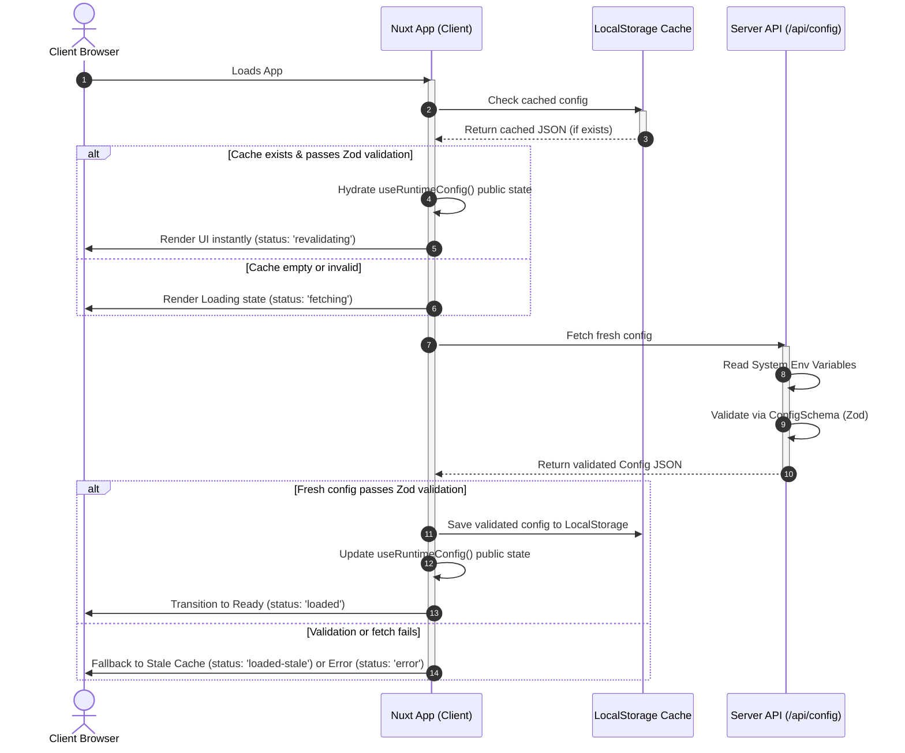

# Nuxt Dynamic Config Loader

A starter template showcasing dynamic, environment-agnostic runtime configuration loading for Nuxt Single Page Applications (SPAs) and Static Site Generation (SSG). 

Instead of embedding environment-specific values at build-time, the app retrieves and validates its configuration at startup from a central API endpoint, leveraging client-side caching (`localStorage`) and a shared Zod schema. This enables a **"build once, run anywhere"** workflow across development, staging, production, and native mobile (Capacitor) environments.

---
### RFC
The RFC for this POC is here https://github.com/bcgov/connect/discussions/3

---

## Architecture & Bootstrapping Flow

The following diagram illustrates how the Nuxt client bootstrapping plugin ([bootstrap.client.ts](file:///Users/thor/Developer/thor.dev/nuxt-config/app/plugins/bootstrap.client.ts)) handles instant hydration via cache, background revalidation, and Zod validation:



---

## Features

- **Build Once, Deploy Anywhere**: Compile static assets once, serve the same bundle across all stages, and let the client fetch its config dynamically.
- **Shared Validation**: Both server-side API `/api/config` and client-side bootstrap plugin utilize a shared Zod schema ([shared/config.schema.ts](file:///Users/thor/Developer/thor.dev/nuxt-config/shared/config.schema.ts)) to guarantee configuration integrity.
- **Optimized UX**: Instantly boots using `localStorage` cache while performing background revalidation.
- **Mobile Friendly**: Supports protocol-aware API routing to handle Capacitor/native mobile platforms (prefixing base URLs when running via `file:` protocol).

---

## How to Run

This project uses **pnpm** for package management.

### 1. Install Dependencies
```bash
pnpm install
```

### 2. Run in Development
Start the dev server at `http://localhost:3000`:
```bash
pnpm dev
```

### 3. Production Build & Preview
Build the application for production:
```bash
pnpm build
```

Locally preview the production build:
```bash
pnpm preview
```

### 4. Code Quality & Formatting
Run ESLint to check for linting issues:
```bash
pnpm lint
```

Run TypeScript compiler type-checking:
```bash
pnpm typecheck
```
