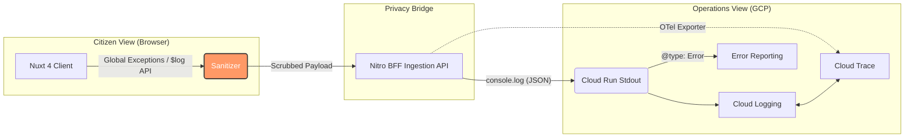

# Secure Nuxt 4 + GCP Observability Framework
A zero-trust, privacy-aware observability framework for Nuxt 4 applications deployed to Firebase Hosting, utilizing a Nitro Backend-for-Frontend (BFF) on Cloud Run.

This framework bridges the gap between client-side user experience and backend cloud diagnostics. It captures structured logs, OpenTelemetry (OTel) traces, and unhandled browser exceptions, routing them securely through the BFF to the Google Cloud Platform (GCP) observability suite.

---
### RFC
The RFC for this POC is here https://github.com/bcgov/connect/discussions/4

### Deployment
This follows our standard target deployment environment.
- Nuxt
- Firebase
- CloudRun
- GCP Observability

### Dependencies

This uses the following packages for distributed tracing, metrics, and unique identifiers:

```bash
pnpm install @opentelemetry/sdk-node @opentelemetry/auto-instrumentations-node @google-cloud/opentelemetry-cloud-trace-exporter uuid
pnpm install --save-dev @types/uuid

```

### Architecture Overview
Developers and Operations teams need a unified view. This framework connects the abstract concept of a "frontend error" to a detailed backend cloud diagnostic profile.



---

## Getting Started & Local Verification

Follow these steps to spin it up locally and see the outputs in the terminal window.

### 1. Installation

Install the project dependencies using `pnpm`:

```bash
pnpm install

```

### 2. Run the Development Server

Launch the local server environment:

```bash
pnpm run dev

```

### 3. Verify Local Logging Output

Open the application in your browser (usually `http://localhost:3000`). To test the integration loop, perform the following actions and **check your terminal running the Nuxt process** to view the structured log streams:

#### A. Test PII Masking

Click the **"Emit Sensitive Log (PII)"** button on the dashboard.

Check your terminal. You should see a sanitized JSON log string printed to `stdout`. Notice that the email, password, and credit card numbers are stripped out **before** the backend outputs the log:

```json
{"severity":"WARNING","message":"[Browser] Citizen attempted to update profile metadata configurations","timestamp":"2026-06-10T21:45:00.000Z","client_context":{"url":"http://localhost:3000/","sessionId":"a1b2c3d4-e5f6-7a8b-9c0d-1e2f3a4b5c6d","userAgent":"Mozilla/...","custom_metadata":{"email":"[MASKED_EMAIL]","password":"[MASKED_SENSITIVE_DATA]","billing":{"creditCard":"[MASKED_CARD]","zip":"V8V 1X4"}}}}

```

#### B. Test Application Exceptions

Click the **"Throw Application Exception"** button. The UI will instantly display the red error boundary containing a Support Code signature (e.g., `ERR-A1B2C3D4`).

Check your terminal. An error payload will be printed to `stderr` formatted with the explicit Google Error Reporting header (`@type`) and the matching user session metadata:

```json
{"severity":"ERROR","message":"[Browser] Database integrity check failed during client form transmission.","timestamp":"2026-06-10T21:46:15.000Z","client_context":{"url":"http://localhost:3000/","sessionId":"a1b2c3d4-e5f6-7a8b-9c0d-1e2f3a4b5c6d","userAgent":"Mozilla/...","custom_metadata":{"context":"Vue Error Boundary: click hook"}},"@type":"type.googleapis.com/google.devtools.clouderrorreporting.v1beta1.ReportedErrorEvent","stack_trace":"Error: Database integrity check failed during client form transmission.\n    at Proxy.triggerVueError (./app/pages/index.vue:52)..."}

```

---

## Deployment Configuration

When deploying this service to **Cloud Run**, ensure the following environment variable is exposed to enable native OpenTelemetry background tracking:

* `GOOGLE_CLOUD_PROJECT`: Your targeted GCP Project ID (used to format trace paths automatically).

Cloud Run will automatically catch all `stdout` and `stderr` streams, map the trace parent headers, and isolate your tracking fields natively inside the Google Cloud Observability console.
